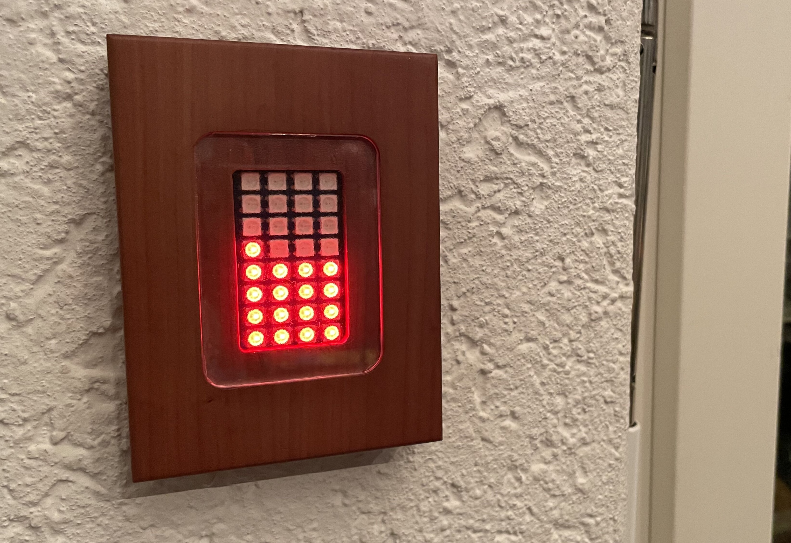

# solrpi

solrpi - a minimalistic, grid consumption and solar power production LED display based on a Raspberry Pi Zero.

## Motivation

To raise awareness about power consumption and solar power production in daily life, I was looking for a very simple, low-power display. 
I found indeed nice-looking dashboards for tablet devices. But for different reasons, they didn't really suit my needs. 
I just wanted a display to show the _current_ consumption and production. 
No history, no average, no aggregation, just what's happening right now, visible at a glance, without reading numbers.

After shortly searching for existing solutions in the Internet without success, this little project idea was born.

## Solution

The solution you are looking at consists of low cost hardware, easily obtainable through online shops selling Raspberry hardware.

Requires:
- Raspberry Pi (preferrably Zero W because of its smaller size, but works also with larger boards)
- an appropriate USB power cable and adapter
- Wifi AP
- RGB LED HAT WS281x
- Python 3.x runtime
- A Web API delivering solar and grid power values (see [Limitations](#limitations))

## Installation

1. Get your raspberry and attach the LED display to it. Make sure it's updated with the latest OS updates.
2. `git clone` this project onto your Raspberry
3. Run a test to see if all system requirements are found and solrpi basically runs: `make test`
4. Install using the installation script: `make install`

## Limitations

Currently only supports Fronius Inverter API but can easily
be extended to work with other inverter brands (or power meters), too, as long as they provide an HTTP REST API to retrieve grid and PV consumption data.
The appropriate structures are prepared, you only need to add the appropriate API handler.

## Disclaimer

You may use this code to implement your own setup. Use at your own risk, it comes as is, without any warranty nor support. See [LICENSE](./LICENSE.txt).

I'm not a Python expert. Though I know about the existence of poetry and alike, I seldomly use those, and so I easily forget about the correct commands. 
That's why I keep a [Makefile](./Makefile): it helps me at least remember how to use virtual env and such... :)

## Casing

You will want to put the display into a casing. There might be some on the market that suit your needs. 
I went for a self-made wooden case, there are some pictures in the [doc](doc/README.md) folder for inspiration.

## Adding support for other power meters / inverters

In order to support other power meters or inverter products, proceed as follows:

1. Implement a new file extending the class [i_inverter.py](solrpi/i_inverter.py) like in [fronius_inverter.py](solrpi/fronius_inverter.py)
2. You may want to write a test file for your API like in [test_solrpi_fronius.py](test/test_solrpi_fronius.py)
3. Modify [solrpi_main.py](solrpi_main.py) to use your new class:
   * Replace Inverter class import statement to import your new class
   * Modify line `inverter = FroniusInverter()` to instantiate and assign your new Inverter class

## 3rd party documentation

RGB LED HAT manual: <https://www.waveshare.com/wiki/RGB_LED_HAT>

Fronius Solar API documentation: <https://www.fronius.com/~/downloads/Solar%20Energy/Operating%20Instructions/42,0410,2012.pdf>
