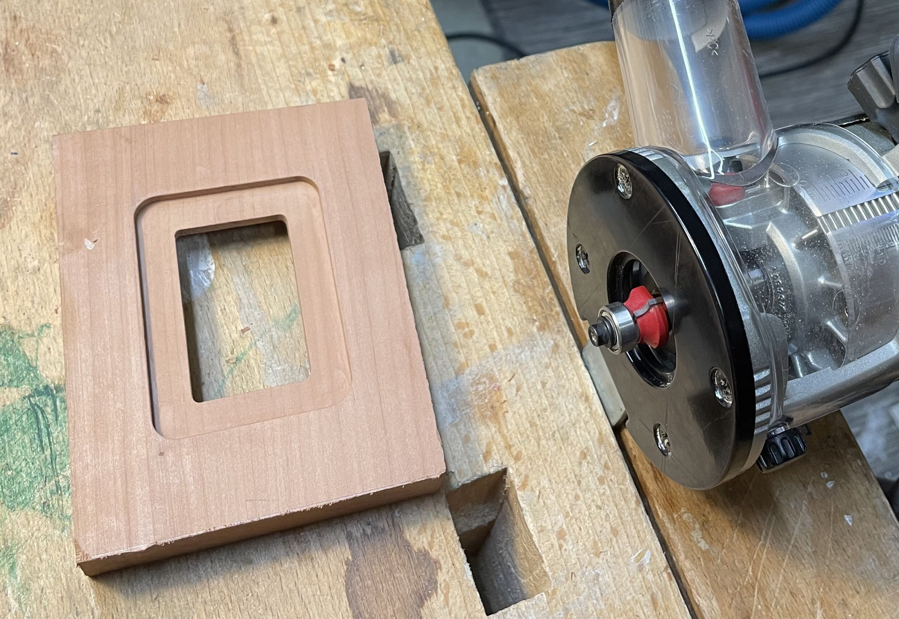
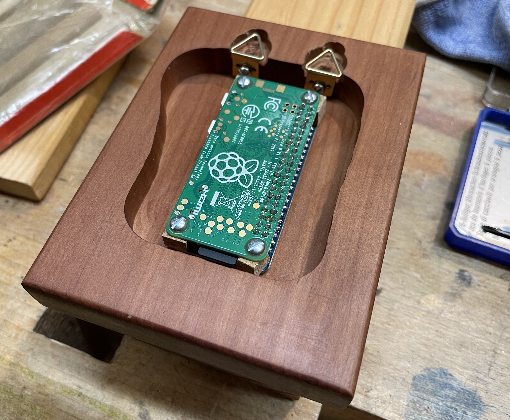
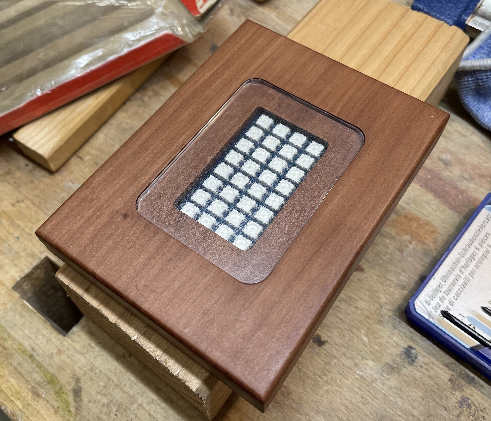
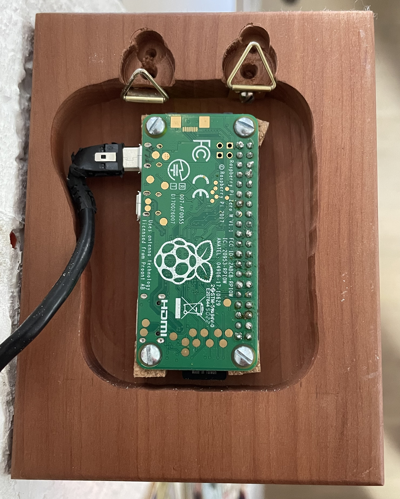
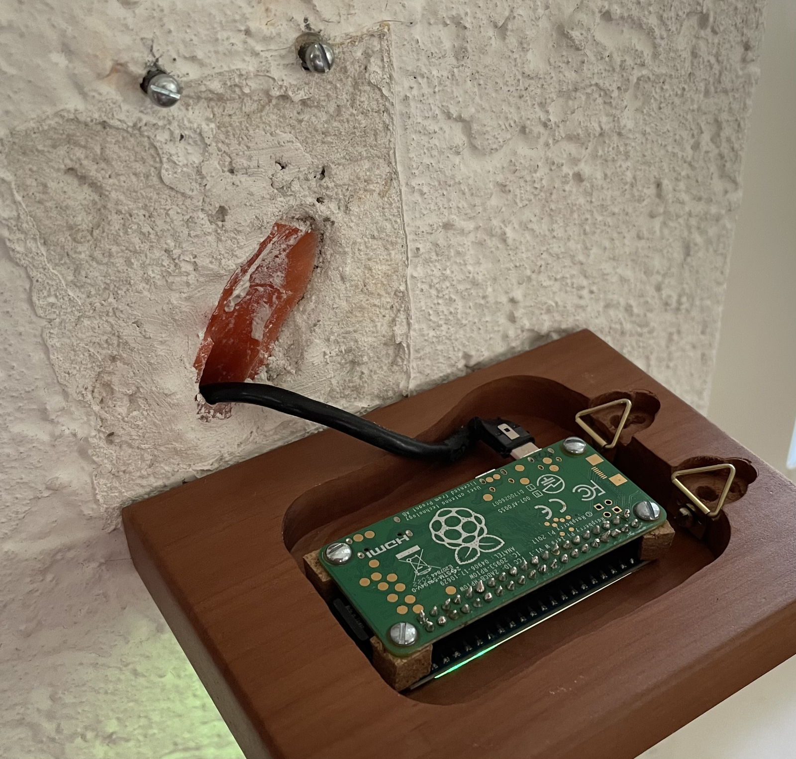
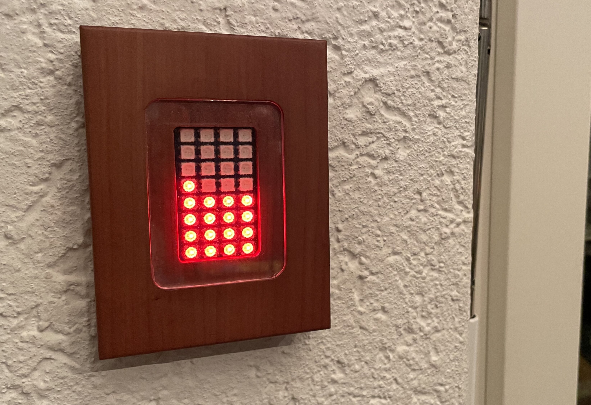

## Wooden casing for solrpi running on a Rapsberry Pi Zero W

First step is to prepare the wood frame:

Next, the Raspberry with display is mounted from the back.

Note that the most challening part was to put the USB power cable into this tiny space. I had to cut away most of the plastic protecting the cable in order to bend it into place. To protect the cables, I put some hot glue around it. 

The acrylic glass fitted into its place:

The USB cable needs to be cut free from too much plastic around the connector plug, is bent into place and is reinforced with some hot glue (not visible on the pic):

Mounted on a wall, with the USB power cable running through some existing installation cable tube, it may look like this in the end:

